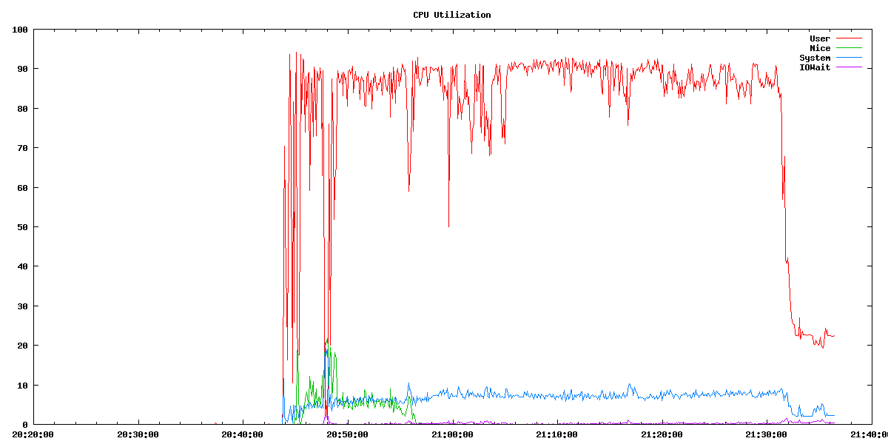

# mlstat 

Denis Sheahan, 2013

[`mlstat`](mlstat) is a command line tool that monitors various aspects of MarkLogic Server performance on Linux. 
It is runs on the MarkLogic node itself and is modeled on the classic Unix tools like vmstat and mpstat. It is designed to be always on, 
running in the background redirecting it's output to a file. It has the ability to tag each line of output with an Epoch or timestamp so the 
data can be correlated with an event

***NB: MarkLogic 7 comes with built-in monitor tools.  If you are using a version earlier that 7, please consider `mlstat`.  If you have 7 or later, you may prefer MarkLogic's [monitoring APIs and dashboard](http://docs.marklogic.com/guide/monitoring).***

# Design

mlstat is a bash script that calls other tools at regular intervals, compares the data 
with its previous sample and normalizes it on a per second basis. The tools it uses are

   - xquery scripts (that need to be installed in a MarkLogic HTTP App Server):
       -  [stats.xqy](stats.xqy) to get docs inserted, forests, stands, active_merges, 
        merge_read_bytes, merge_write_bytes, journal_write_bytes, journal_write_rate, 
        save_write_rate, save_write_bytesin memory-mb, on disk size
   	   - [http-server-status.xqy](http-server-status.xqy) to get stats about a HTTP or xdbc server 
       - [get-hosts.xqy](get-hosts.xqy) to get a list of hosts
   - `iostat` to get disk and cpu performance data
   - `vmstat` to get runnable and blocked processes, swap in/out and context switch performance data
   - `pmap` to get memory sizes for anon and mapped files
   - `/proc`  to get memory sizes forthe MarkLogic process
   - `ifconfig` to calculate network bandwidth
   - The MarkLogic log for interesting events such as saves and merges

# Assumptions

   - mlstat currently only runs on Linux machines
   - mlstat assumes that iostat, pmap and vmstat are available on the system ie the sysstat package has been installed
   - mlstat assumes that iostat, vmstat and ifconfig are in the users `$PATH`
   - mlstat assumes that xquery files stats.xqy, get-hosts.xqy and http-server-status.xqy have been installed in the MarkLogic/Admin directory. If not mlstat will exit.
   - To display database statistics obviously MarkLogic needs to be running

# Options

Use the -h flag for options
 
### Database stats

       -d <database>        Database to monitor
       -j                   Journal stats
       -s                   Save Stats
       -m                   Merge stats
       -a                   In-memory and disk sizes
       -g                   Docs Ingested, Deletes, Re-indexes, stands
       -q                   Query mb
       -c                   Forest cache stats
       -v                   Verbose cache stats
       -I                   ML view of I/O
       -B                   Backup and Restore stats
       -R                   Replication Send and Receive stats
       -l <file location>   Location of log for scraping
       -b <filename>        Dump log events to a seperate file
       -L                   Dump log events to stdout
       -o <http-server>     Http server stats
       -x <xdbc-server>     xdbc server stats
       -r                   Dump stats for Replica forests not regular

### System stats

       -y                   Linux stats - cpu, runnables, blocked,swap
       -n <network name>    Network interface to monitor
       -k <disk name>       Stripe or disk to monitor
       -A                   Aggregate all the disk stats into 1 number
       -M                   Dump memory stats from pmap of the MarkLogic process (requires root)
       -S                   Dump memory stats from /proc of MarkLogic process

### Control

       -U <name>            ML User name other than admin
       -P <passwd>          ML Passwd other than admin
       -f                   Dump stats in comma seperated list for csv
       -e                   Include Epoch per line
       -t                   Include Timestamp per line
       -i <interval>        Set interval, default 10
       -p <count>           Number of samples to take
       -H <hostname>        Dumps stats for just one host in cluster
       -N <hostname>        Run mlstat on this node, default is localhost
       -C <comment>         Prepend this comment to each line
       -X                   Suppress headers
       -D                   Include Date in timestamp

# Running mlstat

The only required flag is `-d <database-name>` if you are tracking one of the database statistics. The `-d` parameter specifies which 
database to extract performance data from.  However no flags means no data! There is no set of default data
By default mlstat prints on a 10 second interval. Use the `-i <interval>` flag to change this.   mlstat measures the actual interval taken 
and uses this value for all rate stats calculated

It is recomended to add a timestamd to each line of mlstat output making it possible to plot results later and pinpoint performance issues (use the `-e`, `-t` or `-D` flags)

Due to the potential size of the Error Log, checking the log is not enabled by default.   However if you 
specify the -s (saves) or -m (merges) flags the ErrorLog file will be scraped to get save and merge counts on this node

Like other tools mlstat dumps a header every 10 samples, to supress this header specify the -X flag

Also like other tools you can restrict the number of samples to collect with the -p flag
 

mlstat can be run on multiple nodes at the same time. In this mode it is highly recommended to use -H <node name> to collect the data for that particular node.

# Generating Graphs

mlstat with the -f option produces a comma delimited csv file that can be used to generate graphs in Excel or other tools.  

    Epoch,Docs/s,Del/s,Ridx/s,Stands,Q-MB/s,%user,%nice,%system,%idle,%iowait,%steal,Rnble,Blcked,Swp-in,Swp-out,CntxS,NtRxKb,NtTxKb,J-MB/s,NumSv,Sv-MB/s,A-Mergs,C-Mergs,M-rMB/s,M-wMB/s,Tt-WMB,S-iops,J-iops,MR-iops,MW-iops,T-wops,S-lat,J-lat,MR-lat,MW-lat,S-ld,J-ld,MR-ld,MW-ld,
	1374589019,468,0,0,8,0,4.38,2.81,1.23,91.57,0.00,0.00,1,0,0,0,3814,7993,574,9,0,1,2,0,51,48,58,2,18,103,96,117,2.16,2.18,0.22,1.92,  0.03,  0.06,  0.01,  0.16    
    1374589029,493,0,0,5,0,5.98,1.98,1.32,90.72,0.00,0.00,4,0,0,0,3533,11863,764,10,0,1,0,1,48,48,60,2,20,97,97,120,2.29,2.40,0.22,1.99,  0.02,  0.05,  0.01,  0.17
    1374589040,462,0,0,6,0,4.93,0.00,0.69,94.38,0.00,0.00,2,0,0,0,3314,8601,591,9,1,29,0,0,0,0,38,58,18,0,0,77,1.28,2.13,0,0,  0.05,  0.05,  0.01,  0.09

My preference is gnuplot you can find a Linux tarball [gnuplot-4.4.4.tar](gnuplot-4.4.4.tar).   To install, download this file and 
do a make install.  I have created a script called [`generate_graphs`](generate_graphs) which creates plots from comma separated mlstat data.  In order to plot and epoch or timestamp is needed for all lines.  The plots generated are controlled by a plot_file for example:

    cpu.png,CPU Utilization,%user,User,%nice,Nice,%system,System,%iowait,IOWait
    docs.png,Doc ingested per Second,Docs/s,Docs
    stands.png,Total Stands,Stands,Stands
    network.png,Network Tx and Rx Kbits,NtRxKb,Receive Kb/s,NtTxKb,Transmit Kb/s
    saves.png,Saves / Active Merges / Complete Merges,NumSv, Number Saves,A-Mergs,Active Merges,C-Mergs,Completed Merges
    ml-io.png,Journal / Save / Merge Read and Write MB/s,J-MB/s,Journal MB/s,Sv-MB/s,Save MB/s,M-rMB/s,Merge Read MB/s,M-wMB/s,Merge Write MB/s
    ml-read.png,Merge Read MB/s,M-rMB/s,Merge Read MB/s
    ml-write.png,Merge Write MB/s,M-wMB/s,Merge Write MB/s
    journal-io.png,Journal Write MB/s,J-MB/s,Journal MB/s
    save-io.png,Save Write MB/s,Sv-MB/s,Save MB/s
    memory.png,Memory size,Mem-MB,Memory MB
    disk_size.png,Disk size,Disk-MB,On Disk MB
    mmaped_files.png,Memory Mapped file size MB,MM-MB,total-size,MM-RSS,allocated
    anon.png,Anon memory size MB,A-MB,total-size,A-RSS,allocated
    process_size.png,MarkLogic memory size MB,Tot-MB,total-size,Tot-RSS,allocated
    total_write.png,Total write MB/s,Tt-WMB, Disk Write(MB/s)
    iops.png, Total IOPS,S-iops,Save IOPS,J-iops, Journal IOPS,MR-iops, Merge Read IOPS,MW-iops, Merge Write IOPS,T-wops, Total IOPS
    latency.png, I/O Latency,S-lat, Save Latency,J-lat, Journal Latency,MR-lat, Merge Read Latency,MW-lat, Merge Write Latency
    load.png, I/O Load,S-ld, Save Load,J-ld, Journal Load,MR-ld, Merge Read Load,MW-ld, Merge Write Load  
    latency_save.png,I/O Latency,S-lat,Save Latency
    latency_mr.png,I/O Latency,MR-lat,Merge Read Latency
    latency_mw.png,I/O Latency,MW-lat,Merge Write Latency
    latency_journal.png,I/O Latency,J-lat,Journal Latency

The format of the file is `<plot_file_name>,<Title of plot>,<data-field1>,<data-field1-description>,<data-field2>,<data-field2-description>`.....

This example plot_file will generate plots cpu.png, docs.png etc.   The first plot generated will be cpu.png and have a title "CPU Utilization".  It will plot mlstat data %user vs %nice vs %system vs %iowait.  An example output would be:

### Sections of mlstats output

If the -e flag is specified mlstat will print the Linux epoch at the start of every line. This is extremely useful for plotting data

    Epoch
    1351829932
    1351829937

 
 Specifying -t will convert this epoch to timestamp from the Linux date command

    Time
    10:40:57
    10:41:07
    10:41:17

 Specifying -D will emit both a date a time, handy for tests that run over a number of days

    Time
    2012-11-20 14:39:37
    2012-11-20 14:39:43

### The Log File
 By using the -b or -L flags Save and Merge events written to the MarkLogic log can be printed by mlstat

    2012-11-02 16:18:07.718 Info: Merged 1 MB in 10 sec at 0 MB/sec to /var/opt/MarkLogic/Forests/App-Services/00000002
    2012-11-05 10:49:11.139 Info: Saved 147 MB in 4 sec at 40 MB/sec to /space/mldata/Forests/cpox-1-5/00000000

Using -b <filename> option to redirect this output to a file
Using -L prints this output to standard out

If for some reason the ErrorLog is being written to a different location use -l <log-file-name> to indicate this to mlstat

As mentioned previosly if -m or -s flags are used then the log file will be scraped to get counts of merges and saves respectively

### mlstat sections

mlstat can print many different stats in any combination by specifying various flags

In addition by specifying -H <node name> just the ML stats for the specified node will be printed.  It is important to use the fully qualified nodename eg foobar.marklogic.com as defined in the cluster or the data cannot be extracted

### Journal Stats -j flag

 The -j option simply prints the MB/s of journal files written to disk. By default this is for all nodes -H <node name> specifies a particular node

    J-MB/s
    55
    72
    74
 
### Save Stats -s flag

The -s option prints the number of saves of in-memory stands to disk and the MB/s of Save data for the cluster.   Again by default this is for all forests, -H <nodename> for a single node

    NumSv Sv-MB/s
    3      135
    3      190
    6      49
 

### Merge Stats -m flag

The -m option prints the number of Merges currently active (A-Mergs), completed in the last period (C-Mergs) and the MBs per second Reads and Writes for merges across the entire cluster

    A-Mergs C-Mergs M-rMB/s M-wMB/s
    12         0   140     133
    12         0   130     126
    12         0   133     127

Note the Merge-rMB/s usually does not equal Disk I/O and a good percentage of the reads will be satisfied by the Linux filesystem cache

### Sizing stats -a flag

The -a option dumps the size the in-memory stands and the current size of the stands on disk.   Again if -H <nodename> is used then only the space for that node is displayed

    Mem-MB Disk-MB
    13551 3726
    12300 4379

### Docs per second -g flag
 

The -g flag dumps Docs ingested, Deleted and Re-indexed  per second and current Stands in the database.  The stand count will include both in-memory stands and on-disk stands

    Docs/s        Del/s   Ridx/s  Stands
    980           3       0       52     
    1494          3       0       52
 

### Query MB per second -q flag

The -q flag dumps the MB per second read from disk for queries. This is an approximation of query processing load

    Q-MB/s
    52
    36
 

### Forest Cache stats -c flag

With the -c flag you can dump the hit rates of the List cache (LC) and Compressed Tree Cache (CTC)

    Epoch       %LC-Ht %CTC-Ht
    1352752818     91    13
    1352752824     91    13
    1352752831     91    13
    1352752837     91    13
    1352752844     91    13
    1352752850     91    13
    1352752857     91    13
 

### ML View of I/O -I flag

The -I flag gives a view of I/O from inside the MarkLogic Server

    Tt-WMB S-iops J-iops MR-iops MW-iops T-wops S-lat    J-lat MR-lat MW-lat S-ld J-ld MR-ld MW-ld 
     14     7       4       16      16      28  3.90    42.95   12.26   3.72 0.04 0.22 0.17 0.07
     13     1       4       21      20      26  0.70    55.31   13.35   3.71 0.02 0.25 0.22 0.07
     36     15      3       52      53      72  7.43    86.84   9.15    5.26 0.07 0.26 0.34 0.19
     13     12      4       9       9       26  7.06    57.15   15.12   7.50 0.08 0.27 0.23 0.12
 

The fields are as follows:

    - Tt-WMB Total MB/s of Write for this DB
    - S-iops 512k IOPs per second of Save of internal forests to disk
    - J-iops 512k IOPs per second of Journal writes
    - MR-iops 512k IOPs per second of Merge Read data
    - MW-iops 512k IOPs per second of Merge Write data
    - T-wops Total 512k Write ops per second
    - S-lat Average latency of the Save IOPs from a MarkLogic perspective (included queuing)
    - J-lat Average latency of the Journal IOPs from a MarkLogic perspective (included queuing)
    - MR-lat Average latency of the Merge Read IOPs from a MarkLogic perspective (included queuing)
    - MW-lat Average latency of the Merge Write IOPs from a MarkLogic perspective (included queuing)
    - S-ld Save load value (from forest status)
    - J-ld Journal load value (from forest status)
    - MR-ld Merge Read load value (from forest status)
    - MW-ld Merge Write load value (from forest status)

### Backup and Restore stats -B flag

The -B flag measures the MB/s for backup and restore. It dumps the 512KB Read and Write ops per second for both backup and restore. It also dumps MarkLogics internal measurement of load for these operations.  Finally based on the cpu time spent on the operation it calculates latency

During a backup the stats will look something similar to the

    B-Rdops B-Wrops R-Rdops R-Wrops B-Rdlat B-Wrlat R-Rdlat R-Wrlat B-Rdld B-Wrld R-Rdld R-Wrld 
     0          0       0       0       0       0       0       0   0.00    0.00    0.00 0.00
     0          0       0       0       0       0       0       0   0.00    0.00    0.00 0.00
     0          0       0       0       0       0       0       0   0.00    0.00    0.00 0.00
     30         30      0       0   12.96   2.10        0       0   0.23    0.04    0.00 0.00
     43         43      0       0   17.97   10.33       0       0   0.58    0.26    0.00 0.00
     43         43      0       0   20.86   42.36       0       0   0.80    1.19    0.00 0.00
     75         75      0       0   22.34   41.83       0       0   1.21    2.10    0.00 0.00
     72         72      0       0   25.46   33.60       0       0   1.63    2.50    0.00 0.00
      

### Database Replication Send and Receive stats -R flag
 

The -R flag dumps the send and receive KB per second for database replication. Note this does not represent network traffic for local disk replication

    R-RcvKB R-SndKB R-Rcvlt R-Sndlt R-Rcvld R-Rcvld 
     0          0       0       0   0.00    0.00
     0          0       0       0   0.00    0.00
     0          0       0       0   0.00    0.00
 

### Stats for a HTTP Server -o flag or an xdbc Server -x flag

With -o <http-server-name> or -x <xdbc-server-name>, stats from a HTTP or xdbc server can be dumped.   By default the query rate, current count of outstanding requests, number of outstanding update requests, active threads in the server and the Extended Tree Cache (ETC) hit rate are dumped. Note we  add the name of the HTTP/xdbc server to the heading of each field (in the example 8007-cpox)

    8007-cpox-Rate 8007-cpox-Cnt 8007-cpox-Upd 8007-cpox-Thr 8007-cpox-ETC
        17.51           10              0           12              57
        21.85           10              1           11              57
        15.83           10              0           11              57
        13.02           10              0           12              57
        12.17           10              0           11              57

In addition adding the -v flag dumps statistics for the other caches (fs program cache,db program cache,env program cache fs main module sequence cache, db main module sequence cache, fs library module cache, db library module cache)  These caches do not tend to be an issue and are included for completeness.

    8007-cpox-FPC 8007-cpox-DPC 8007-cpox-EPC 8007-cpox-FMMSC 8007-cpox-DMMSC 8007-cpox-FLMC 8007-cpox-DLMC
        50              50              0           0               50              0           50
        58              50              0           0               50              0           50
        58              50              0           0               50              0           50
        58              50              0           0               50              0           50

Note xcc AppServers do not have an env program cache

### Systems stats -y flag
 

The -y flag dumps the breakdown of cpu time spent, runnable and blocked processes, swap in and out and context switches per second for this node.

For cpu breakdown There is percent user, nice, system,idle, iowait and steal. The nice percentage is an indication of how much cpu is being spent on merges

    %user %nice %system %idle %iowait %steal Runble Blcked Swp-in Swp-out   CntxS
     0.93 10.0  0.36    88.56   0.00    0.15    50      1   0       0       36536
     1.16 12.0  0.34    88.35   0.00    0.15    39      0   0       0       34493
     0.84 10.5  0.39    88.59   0.00    0.19    38      0   0       0       34988
     1.69 11.7  0.55    87.57   0.00    0.19    39      0   0       0       35180

The Runnable field indicates how many threads are in the queue for cpu and blocked are those waiting

### Disk I/O -k flag

By specifying -k <disk-name> mlstat will dump the I/O statistics on this node.  The device can be a stripe such as md0 or individual disks such as /dev/xvdl. 

    xvdl-rs ws      rMBs wMBs svct %utl 
     17.74  90.95   0.57 3.59 1.19 12.94
     10.57  62.11   0.04 2.34 1.31 9.53
     8.50   62.20   0.03 2.33 1.08 7.64
     9.70   56.80   0.04 2.06 1.07 7.12

Users can specify multiple disks using the | character. Note the | must be escaped on Linux so the command would be -k xvdl\|xvdm

    xvdl-rs ws      rMBs wMBs   svct %utl   xvdm-rs ws      rMBs wMBs svct %utl 
     17.61  91.31   0.56 3.60   1.19 12.95  16.66   90.05   0.52 3.55 1.45 15.51
     29.60  282.30  0.90 11.15  0.97 30.28  9.20    45.10   0.04 1.68 1.97 10.72
     7.70   241.10  0.03 9.56   1.16 28.84  6.80    49.70   0.03 1.84 1.83 10.32
     7.30   282.80  0.03 11.24  1.04 30.24  7.00    47.00   0.03 1.68 4.27 23.04
 
### Aggregate Disk I/O -A flag

If multiple disks are specified then the -A flag can be included to aggregate the data from all these disks. We do the following for each field

    rs (reads per second) : Accumulate values for all disks
    ws (writes per second) : Accumulate values for all disks
    rMBs (reads MB per second) : Accumulate values for all disks
    wMBs (writes MB per second) : Accumulate values for all disks
    svct (Service time) : Average from all disks
    %utl (Percent Utilization) : Average from all disks

    rds wrs rMBs wMBs   svct %utl 
    34 183 1.07 7.25   1.32 14.41
    17 389 0.07 15.54  1.40 28.25
    11 375 0.05 14.86  1.44 27.88
    11 351 0.04 13.91  1.33 24.14

### Network I/O -n flag
By specifying -n <network device> mlstat will dump the Network Bandwidth in Kbits per second

    NetRxKb NetTxKb
    23866  51476
    23058  36835
    19896  35025
 

### Memory stats using pmap -M flag

The -M flag uses the Linux utility pmap to determine how much memory have been allocated to Anon and Memory mapped files in the MarkLogic process. For each it has two fields, memory in MB requested and the current Resident Set Size (RSS) of the allocation. The RSS indicates how much memory Linux has actually assigned.

    A-MB A-RSS MM-MB MM-RSS Tot-MB Tot-RSS 
    5779 2376  229     85  6167    2486
    5783 2413  235     92  6177    2529
    5783 2446  235     92  6177    2562
    5823 2483  236     92  6219    2600
    5819 2520  236     92  6215    2637
 

 

### Memory stats using /proc -S flag
On some Linux systems, notably Red Hat, you need root permission to use pmap on the MarkLogic daemon process.

As an alternative most of the same data can be accquired via /proc. The -S flag uses /proc to collect RSS and process size information

    Pk-MB Sz-MB HWM-MB RSS-MB Data-MB 
     7729 6160  3401    2538    5778
     7729 6163  3401    2574    5781
     7729 6163  3401    2612    5781
     7729 6201  3401    2648    5818

The meaning of each of these fields is as follows

    Pk MB : /proc VmPeak value, peak VM size of the MarkLogic process
    Sz-MB : /proc VmSize value, current VM size of the MarkLogic process
    HWM-MB : /proc VmHWM value, peak RSS for the MarkLogic process
    RSS-MB : /proc VmRSS value, current RSS for the MarkLogic process
    Data-MB : /proc VmData value, size of data segment for the MarkLogic process

 **********************************************************************************************
 Note cpu, disk and network stats are only for the ML node running mlstat ie -H <nodename> does not
 work for these stats. -H will work with all other stats
 **********************************************************************************************

# Examples:

     ./mlstat -d cpox -g
    
     Monitor the ingest rate and stand count for the database cpox
     
     ./mlstat -d cpox -g -t
    
     Monitor the ingest rate and stand count for the database cpox with a timestamp on each line
    
     ./mlstat -d cpox -g -t -j -m -s
    
     Monitor the ingest rate, Journal MB/s, Merge read and write MB/s, Save MB/s and stand count for the database cpox with a timestamp on each line
    
     ./mlstat -d cpox -g -t -j -m -s -y
    
     Monitor the ingest rate, Journal MB/s, Merge read and write MB/s, Save MB/s and stand count for the database cpox. Add the cpu stats for this node. With a timestamp on each line
    
     ./mlstat -d cpox -g -t -j -m -s -y -i 60
    
     Monitor the ingest rate, Journal MB/s, Merge read and write MB/s, Save MB/s and stand count for the database cpox. Add the cpu stats and for this node. With a timestamp on each line and set  the interval to every 60 seconds
    
     ./mlstat -d cpox -g -t -j -m -s -y -i 60 -n eth0
    
     Monitor the ingest rate, Journal MB/s, Merge read and write MB/s, Save MB/s and stand count for  the database cpox. Monitor the cpu stats and network eth0 for this node. With a timestamp on each line and set the interval to every 60 seconds
    
     ./mlstat -d cpox -B
    
     Monitor the Backup and Restore I/O for the database cpox
    
     ./mlstat -d cpox -R
    
     Monitor the Database replication network traffic for the cpox database
    
     ./mlstat -d cpox -I
    
     Dump MarkLogics view of I/O for the cpox database
    
     ./mlstat -k xvdl\|xvdm
    
     Monitor two disks, xvdl and xvdm on this server
    
     ./mlstat -k xvdl\|xvdm -A
    
     Monitor two disks, xvdl and xvdm on this server but accumulate their stats
    
     ./mlstat -M
    
     Monitor the memory usage of the MarkLogic daemon using pmap
    
     ./mlstat -S
    
     Monitor the memory usage of the MarkLogic daemon using /proc
    
     ./mlstat -d cpox -x 9000-xcc 
    
     Monitor the XDBC server 9000-xcc on the database cpox
    
     ./mlstat -d cpox -x 9000-xcc -v
    
     Monitor the XDBC server 9000-xcc on the database cpox and add its cache hit rates
    
# License
    
[Apache 2.0](http://www.apache.org/licenses/LICENSE-2.0.html)
